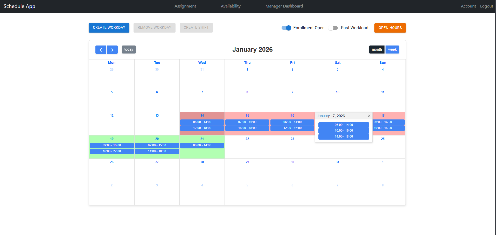

# Schedule App 📅

> A robust shift management system for employees and managers, built with Django REST Framework and React.



## 💡 About The Project

Schedule App is a Single Page Application (SPA) designed to streamline workforce management. It solves the problem of manual scheduling by providing a digital interface for defining availability, assigning shifts, and handling shift swaps.

I built this project to demonstrate proficiency in **full-stack development**, specifically focusing on complex database relationships and a clean separation of concerns between the backend API and the frontend client.

## ✨ Key Features

- **Role-Based Access Control (RBAC):** Distinct interfaces and permissions for **Managers** and **Employees**.
- **Interactive Scheduling:** Visual calendar interface for viewing workdays and shifts using FullCalendar.
- **Availability Management:** Employees can declare their available hours for specific days.
- **JWT Authentication:** Secure, stateless authentication using JSON Web Tokens.

## 🛠️ Tech Stack

### Backend

- **Python 3.10+ & Django 4.2**
- **Django REST Framework:** For building the RESTful API.
- **PostgreSQL:** Robust relational database for data persistence.
- **SimpleJWT:** For secure authentication.

### Frontend

- **React.js:** Functional components and Hooks.
- **Material UI (@mui) & React Bootstrap:** For responsive, accessible UI design.
- **FullCalendar:** For advanced scheduling visualizations.
- **Axios:** For API integration with interceptors.

### DevOps & Tools

- **Docker & Docker Compose:** Containerization for consistent development and deployment environments.
- **Git:** Version control.

## Getting Started

The easiest way to run the application is using Docker.

### Prerequisites

- Docker & Docker Compose

### Installation (Docker)

1.  Clone the repository:

    ```bash
    git clone [https://github.com/Ralfmat/schedule_app.git](https://github.com/Ralfmat/schedule_app.git)
    cd schedule_app
    ```

2.  Build and run the containers:

    ```bash
    docker-compose up --build
    ```

3.  Access the application:
    - **Frontend:** http://localhost:3000
    - **Backend API:** http://localhost:8000

### Local Installation (Without Docker)

<details>
  <summary>Click to expand local installation instructions</summary>

#### Backend

1. Navigate to backend: `cd backend`
2. Create virtual env: `python -m venv venv`
3. Activate env: `source venv/bin/activate` (Mac/Linux) or `venv\Scripts\activate` (Windows)
4. Install requirements: `pip install -r requirements.txt`
5. Migrate DB: `python manage.py migrate`
6. Run server: `python manage.py runserver`

#### Frontend

1. Navigate to frontend: `cd frontend`
2. Install dependencies: `npm install`
3. Start application: `npm start`
</details>
